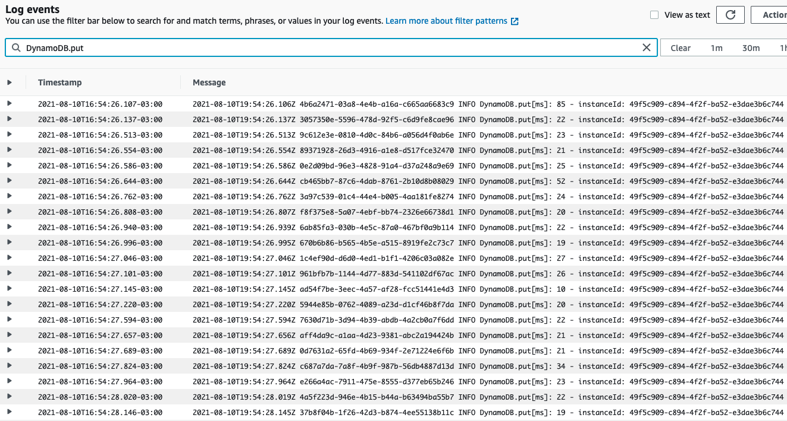
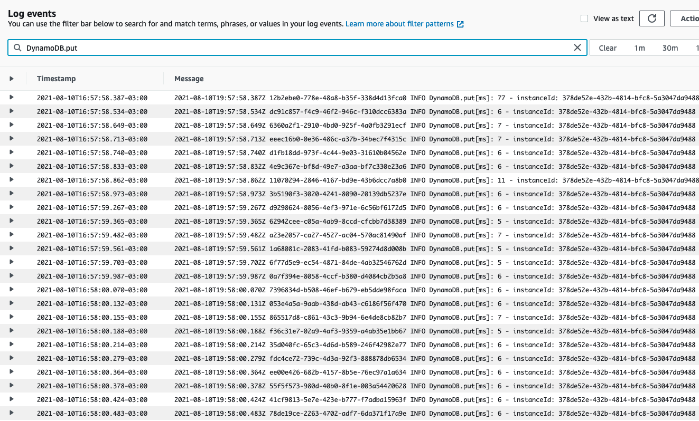

# Reusar conexões

## Geração de massa para testes com JMeter

Na pasta "loadtest-jmeter" existe o arquivo "generate-jmeter-dataset.py" que gera o dataset "user-jmeter-dataset.csv" para usarmos no JMeter e conseguir simular várias requisições em paralelo no API Gateway que chegará na função Lambda.

## Cliente V2 do aws-sdk-js

Na pasta sdk-v2 o teste foi feito com a versão 2 do SDK da AWS para JS. Esta versão é a que vem por padrão no runtime do Node.

Para habilitar o keep-alive é necessário que a variável de ambiente AWS_NODEJS_CONNECTION_REUSE_ENABLED seja configurada para o valor 1, caso contrário não irá usar o keep-alive.

## Cliente V3 do aws-sdk-js

Na pasta sdk-v3 o teste foi feito com a versão 3 do SDK da AWS para JS. Esta versão é a recomendada por ser modular, permitindo a escolha específica do que usar, como por exemplo o DynamoDB.

````
npm install @aws-sdk/client-dynamodb @aws-sdk/util-dynamodb
````

**O keep-alive já é habilitado por padrão, não precisa fazer nada!**

## Resultados

Sem o keep-alive o tempo médio na duração da chamada ao DynamoDB foi de ~22ms, com o keep-alive caiu para ~6ms como pode ser visto nas imagens abaixo.

**Sem o keep-alive**



**Com o keep-alive**



## Referências
* https://docs.aws.amazon.com/sdk-for-javascript/v2/developer-guide/node-reusing-connections.html
* https://docs.aws.amazon.com/sdk-for-javascript/v3/developer-guide/node-reusing-connections.html
* https://theburningmonk.com/2019/02/lambda-optimization-tip-enable-http-keep-alive/